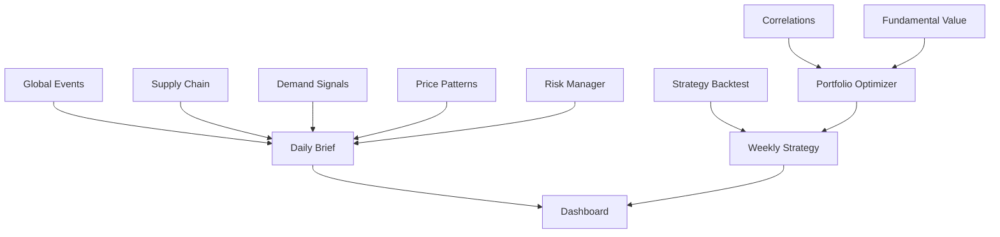

# OpenClaw Agent Configurations

This directory contains the OpenClaw agent configuration files for the Maccabee Intelligence commodities analysis shop.

## Agent Configuration Structure

Each agent has:
- `config.yaml` - OpenClaw agent configuration
- `prompt.md` - Agent system prompt and instructions
- `tools.yaml` - Tool definitions and API configurations
- `schedule.yaml` - Cron schedule and trigger conditions

## Quick Start

```bash
# Deploy all agents
for agent in agents/*/; do
    openclaw agent deploy "$agent"
done

# Start the daily brief
openclaw cron enable daily-brief

# Monitor agent health
openclaw agent status --all
```

## Agent Dependencies



## Configuration Management

- Use environment variables for API keys
- Store sensitive data in OpenClaw secrets
- Version control all configurations
- Test in staging before production deployment
